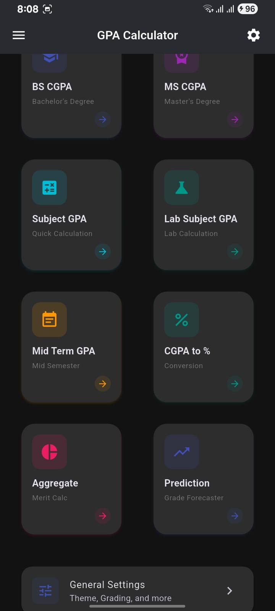
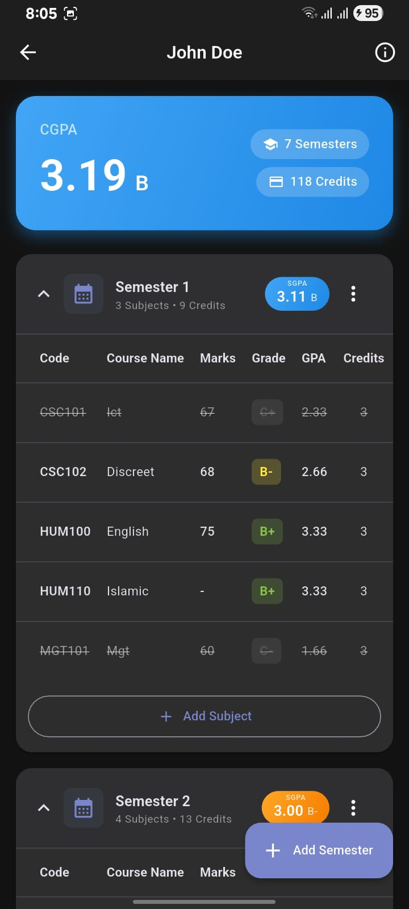
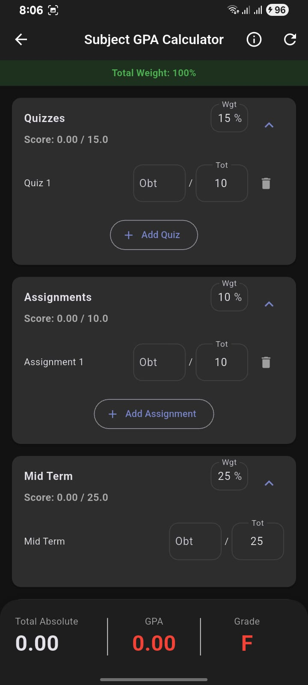
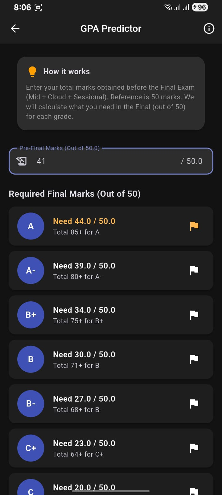
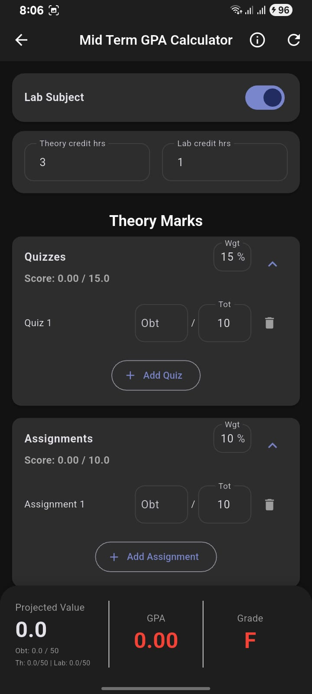
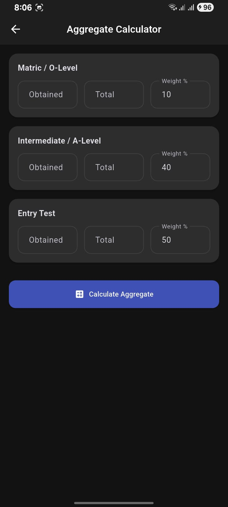
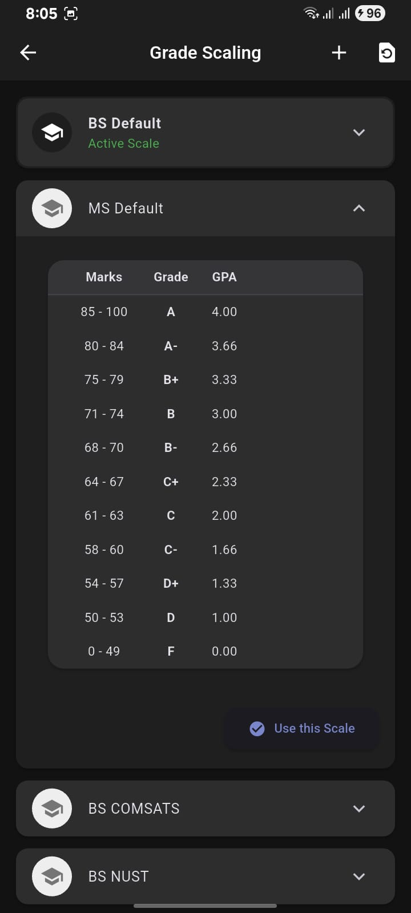

# 📊 GPA Calculator

A comprehensive, feature-rich **CGPA/GPA Calculator** built with Flutter. Designed for students to efficiently track their academic performance across multiple semesters with beautiful UI and powerful tools.

[](https://flutter.dev)
[](https://dart.dev)
[](LICENSE)
[](https://flutter.dev/multi-platform)

---

## ✨ Features

### 📚 Student Management
- **Multiple Student Profiles** – Create and manage separate profiles for different students
- **Semester-wise Organization** – Organize subjects by semesters with expandable/collapsible cards
- **Subject CRUD Operations** – Add, edit, and delete subjects with ease
- **Draft Auto-Save** – Cancelled entries are automatically saved for later
- **Credit Hours Persistence** – Remembers last selected credit hours for faster entry

### 📈 GPA Calculation Tools
- **CGPA Calculator** – Calculate cumulative GPA across all semesters
- **Semester GPA** – View individual semester performance
- **Subject-wise GPA** – Calculate GPA for individual subjects with marks/percentage input
- **GPA Prediction Tool** – Predict required grades to achieve target CGPA
- **Lab GPA Calculator** – Specialized calculator for lab courses
- **Mid-Term GPA Calculator** – Calculate projected GPA based on mid-term assessments

### ⚙️ Customization
- **Multiple Grading Scales** – Support for various grading systems (4.0, 5.0, HEC Pakistan, etc.)
- **Custom Grade Scales** – Create your own grading criteria
- **Dark/Light Theme** – Beautiful UI with theme customization
- **Marks ↔ GPA Conversion** – Input grades as marks or direct GPA values

### 🔄 Smart Features
- **Duplicate Detection** – Warns when adding duplicate subjects
- **Subject History Tracking** – Track removed/hidden subjects
- **Subject Restoration** – Restore previously removed subjects
- **Auto-scroll to Errors** – Scrolls to display validation errors automatically

---

## 📱 Screenshots

<div align="center">

| Home Screen | Student Details | Subject GPA |
|:-----------:|:---------------:|:-----------:|
|  |  |  |

| GPA Predictor | Mid-Term GPA | Aggregate Calculator |
|:-------------:|:------------:|:--------------------:|
|  |  |  |

| Grade Scale Settings |
|:--------------------:|
|  |

</div>

---

## 🚀 Getting Started

### Prerequisites
- Flutter SDK 3.10 or higher
- Dart SDK 3.10 or higher
- Android Studio / VS Code with Flutter extension

### Installation

1. **Clone the repository**
   ```bash
   git clone https://github.com/hadi488/gpa-calculator.git
   cd gpa-calculator
   ```

2. **Install dependencies**
   ```bash
   flutter pub get
   ```

3. **Generate Hive adapters** (if needed)
   ```bash
   flutter packages pub run build_runner build
   ```

4. **Run the app**
   ```bash
   flutter run
   ```

---

## 🏗️ Project Architecture

```
lib/
├── data/
│   ├── models/          # Data models (Student, Subject, Semester)
│   └── services/        # Storage, GPA calculation services
├── features/
│   ├── dashboard/       # Home screen and navigation
│   ├── settings/        # App settings, grade scales, themes
│   ├── splash/          # Splash screen
│   ├── student_management/
│   │   ├── logic/       # State management (Provider)
│   │   ├── screens/     # Student list, subject management
│   │   └── widgets/     # Reusable UI components
│   └── tools/           # GPA calculators and prediction tools
└── main.dart
```

### Tech Stack
- **State Management**: Provider
- **Local Storage**: Hive (NoSQL)
- **Architecture**: Feature-first with separation of concerns
- **UI**: Material Design 3

---

## 🧮 Supported Grading Scales

| Scale | Range | Description |
|-------|-------|-------------|
| Standard 4.0 | 0.0 - 4.0 | US Standard Scale |
| Extended 5.0 | 0.0 - 5.0 | Extended Scale |
| HEC Pakistan | 0.0 - 4.0 | Higher Education Commission |
| Custom | Configurable | Create your own scale |

---

## 📦 Dependencies

| Package | Purpose |
|---------|---------|
| `provider` | State management |
| `hive` / `hive_flutter` | Local NoSQL database |
| `uuid` | Unique ID generation |
| `share_plus` | Share functionality |
| `url_launcher` | Open external links |
| `animated_splash_screen` | Splash screen animation |
| `page_transition` | Page transition animations |

---

## 🤝 Contributing

Contributions are welcome! Please feel free to submit a Pull Request.

1. Fork the project
2. Create your feature branch (`git checkout -b feature/AmazingFeature`)
3. Commit your changes (`git commit -m 'Add some AmazingFeature'`)
4. Push to the branch (`git push origin feature/AmazingFeature`)
5. Open a Pull Request

---

## 📄 License

This project is licensed under the MIT License - see the [LICENSE](LICENSE) file for details.

---

## 👨‍💻 Author

**Hadi**
- GitHub: [@hadi488](https://github.com/hadi488)

---

## 🌟 Show Your Support

Give a ⭐ if this project helped you!

---

<p align="center">Made with ❤️ using Flutter</p>
